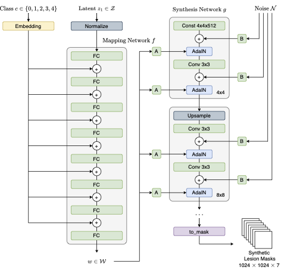
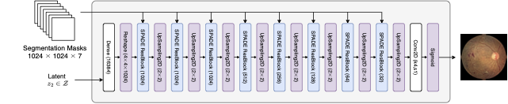
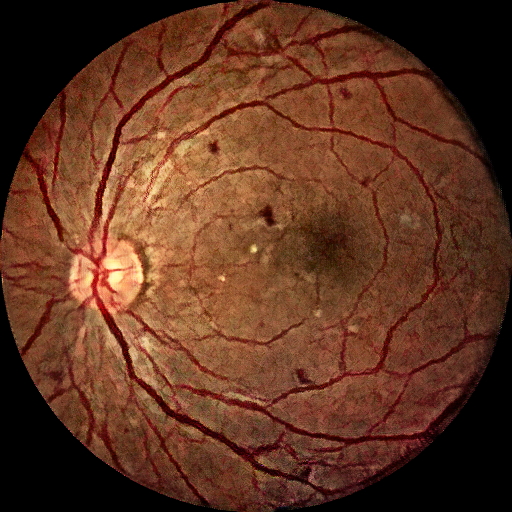

# RetinaGAN

Code Repository for [**High-Fidelity Diabetic Retina Fundus Image Synthesis from Freestyle Lesion Maps**]().

## About

RetinaGAN a two-step process for generating photo-realistic retinal Fundus images based on artificially generated or free-hand drawn semantic lesion maps.

<p align="center">

</p>

StyleGAN is modified to be conditional in to synthesize pathological lesion maps based on a specified DR grade (i.e., grades 0 to 4). The DR Grades are defined by the International Clinical Diabetic Retinopathy (ICDR) disease severity scale; no apparent retinopathy, {mild, moderate, severe} Non-Proliferative Diabetic Retinopathy (NPDR), and Proliferative Diabetic Retinopathy (PDR). The output of the network is a binary image with seven channels instead of class colors to avoid ambiguity.

<p align="center">

</p>

The generated label maps are then passed through SPADE, an image-to-image translation network, to turn them into photo-realistic retina fundus images. The input to the network are one-hot encoded labels.

<p align="center">

</p>

## Usage

Download model checkpoints (see [here](checkpoints/README.md) for details) and run the model via Streamlit. Start the app via `streamlit run web_demo.py`.

## Example Images

Example retina Fundus images synthesised from Conditional StyleGAN generated lesion maps. Top row: synthetically generated lesion maps based on DR grade by Conditional StyleGAN. Other rows: synthetic Fundus images generated by SPADE. Images are generated sequentially with random seed and are **not** cherry picked.

| grade 0                                                      | grade 1                                                      | grade 2                                                      | grade 3                                                      | grade 4                                                      |
|--------------------------------------------------------------|--------------------------------------------------------------|--------------------------------------------------------------|--------------------------------------------------------------|--------------------------------------------------------------|
|            |            |            |            |            |
|  |  |  |  |  |
|  |  |  |  |  |

## Cite this work

If you find this work useful for your research, give us a kudos by citing:

```
@misc{retinagan, 
  author={Benjamin Hou and Amir Alansary and Daniel Rueckert and Bernhard Kainz}, 
  title={High-Fidelity Diabetic Retina Fundus Image Synthesis from Freestyle Lesion Maps}, 
  year={2022}, 
}
```

